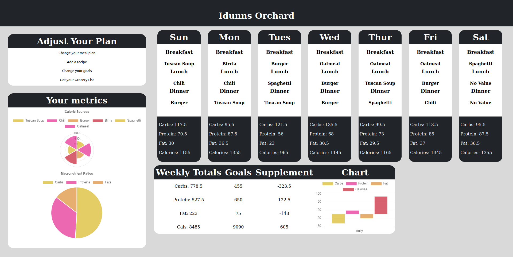
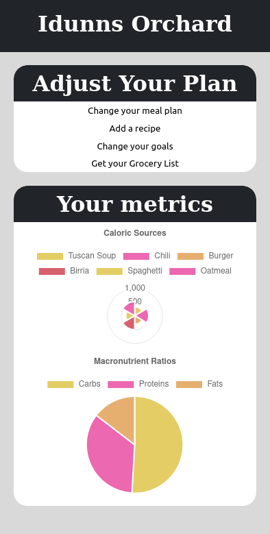
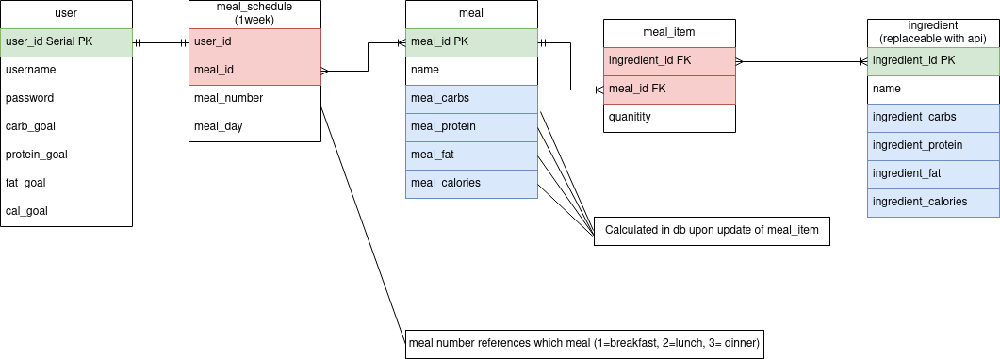
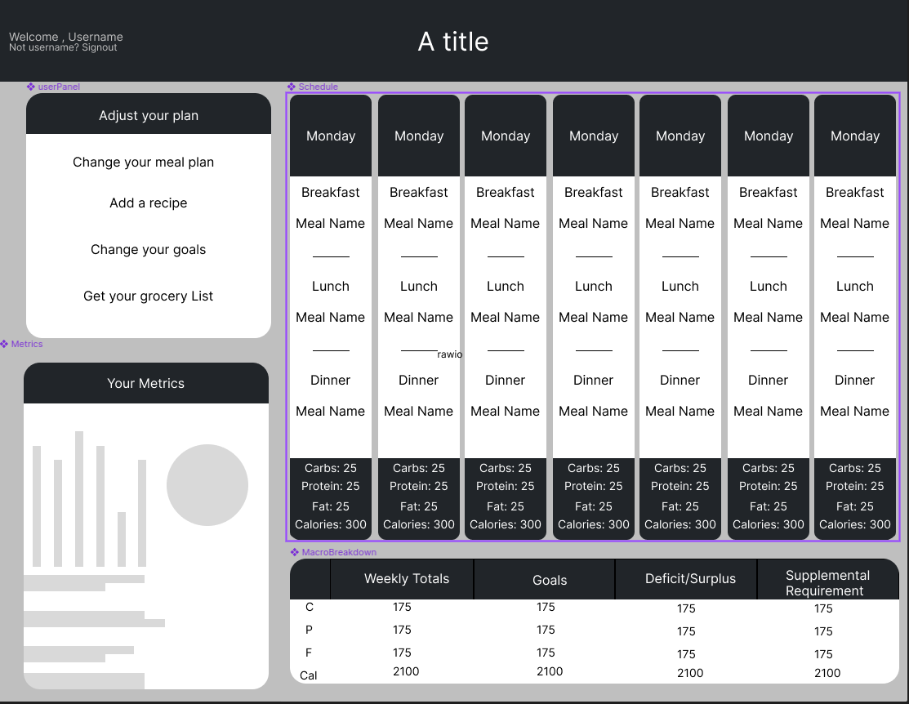

# Idunn's Orchard

## Nutrition and meal planning App

- Site

  - Live: https://idunns-app.onrender.com/
  - Local:
    - `npm i`
    - .env.template -> .env
    - `npm start`

- API
  - Live: https://idunns-orchard.onrender.com
  - Local:
    - `npm i`
    - .env.template -> .env
    - `npm api`

### Features:

- Generate Grocery List based on programmed meals
- Set, update, and track goals using chart.js
- Add recipes that update macros according to searchable ingredients
- Responsive UI with vanilla CSS

### Technologies:

- vite + react
- express
- chart.js + react-chartjs-2
- vitest
- pg
- path

### Planned Features:

- Meal plan editing
- Integration with Nutritionix API for expanded ingredient stats
- Expandable Nutrtion info on each meal
- User Authentication
- Pre-set weekly meal plans

### ERD:

### Wireframe:

